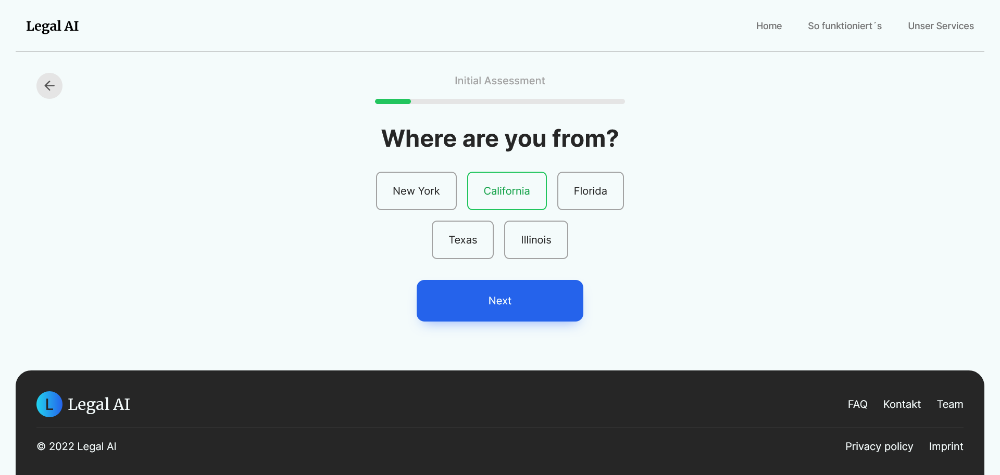

# UC2

## 🛠️ Local development setup guide

1. Clone the repo

   ```sh
   git clone https://github.com/keiken-shin/uc2.git
   ```

2. Install dependencies

   ```sh
   npm i
   ```

3. Start the development server

   ```sh
   npm run dev
   ```

4. Create local build

   ```sh
   npm run build
   ```

## 📸 Application Screenshots

1. Homepage
   

2. So funktioniert's
   

3. Intake (multi-step-form)
   
